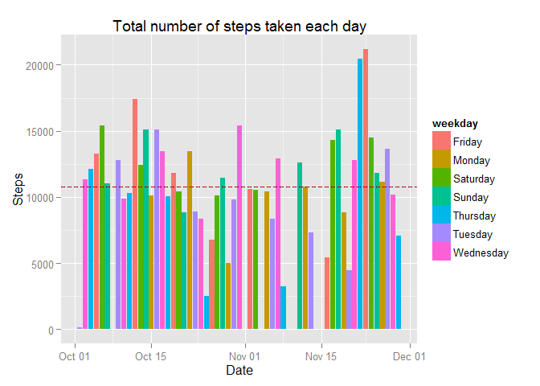
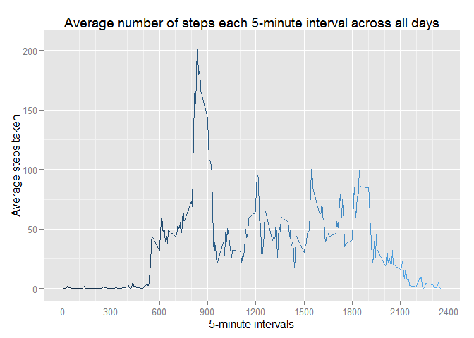

# Reproducible Research: Peer Assessment 1
Philip Mateescu  


### Preamble; Codebook

This assignment makes use of data from a personal activity monitoring device. This device collects data at 5 minute intervals through out the day. The data consists of two months of data from an anonymous individual collected during the months of October and November, 2012 and include the number of steps taken in 5 minute intervals each day.

The data for this assignment can be downloaded from the course web
site:

* Dataset: [Activity monitoring data](https://d396qusza40orc.cloudfront.net/repdata%2Fdata%2Factivity.zip) [52K]

The variables included in this dataset are:

* **steps**: Number of steps taking in a 5-minute interval (missing
    values are coded as `NA`)
* **date**: The date on which the measurement was taken in YYYY-MM-DD
    format
* **interval**: Identifier for the 5-minute interval in which
    measurement was taken

We will be using the *dplyr* library for data processing, and `ggplot2` for drawing:

```r
library(dplyr)
library(ggplot2)
```


## Loading and preprocessing the data
Fortunately, this repository already contains the **activity.zip** file mentioned above.
However, let's guard against the file being missing for whatever reason:


```r
if(!file.exists("activity.zip")){
  download.file("https://d396qusza40orc.cloudfront.net/repdata%2Fdata%2Factivity.zip", destfile="activity.zip")
}
```

We don't need to extract the zip - the `unz` file can do this for us:


```r
step.data <- read.csv(unz('activity.zip', filename = 'activity.csv'), colClasses = c('integer', 'Date', 'integer'))
```

For convenience, we'll also load it into a *dplyr* data frame tbl:

```r
step.data <- tbl_df(step.data)
step.data
```

```
## Source: local data frame [17,568 x 3]
## 
##    steps       date interval
##    (int)     (date)    (int)
## 1     NA 2012-10-01        0
## 2     NA 2012-10-01        5
## 3     NA 2012-10-01       10
## 4     NA 2012-10-01       15
## 5     NA 2012-10-01       20
## 6     NA 2012-10-01       25
## 7     NA 2012-10-01       30
## 8     NA 2012-10-01       35
## 9     NA 2012-10-01       40
## 10    NA 2012-10-01       45
## ..   ...        ...      ...
```

## What is mean total number of steps taken per day?


```r
mean.steps.per.day <- mean(step.data$steps, na.rm = TRUE)
median.steps.per.day <- median(step.data$steps, na.rm = TRUE)

days.with.steps <- step.data  %>% 
    filter(!is.na(steps)) %>% 
    arrange(date) %>%
    mutate(month.name=months(date), weekday=weekdays(date))
print(days.with.steps)    
```

```
## Source: local data frame [15,264 x 5]
## 
##    steps       date interval month.name weekday
##    (int)     (date)    (int)      (chr)   (chr)
## 1      0 2012-10-02        0    October Tuesday
## 2      0 2012-10-02        5    October Tuesday
## 3      0 2012-10-02       10    October Tuesday
## 4      0 2012-10-02       15    October Tuesday
## 5      0 2012-10-02       20    October Tuesday
## 6      0 2012-10-02       25    October Tuesday
## 7      0 2012-10-02       30    October Tuesday
## 8      0 2012-10-02       35    October Tuesday
## 9      0 2012-10-02       40    October Tuesday
## 10     0 2012-10-02       45    October Tuesday
## ..   ...        ...      ...        ...     ...
```

```r
totalsteps.per.day <- days.with.steps  %>% 
    group_by(date) %>%
    summarize(steps.total=sum(steps))
# print (totalsteps.per.day)
sum.steps.total <- sum(totalsteps.per.day$steps.total)
mean.steps.total <- mean(totalsteps.per.day$steps.total)
median.steps.total <- median(totalsteps.per.day$steps.total)
```
**Q1: Make a histogram of the total number of steps taken each day**


```r
ggplot(days.with.steps, aes(x = date, y = steps, fill = weekday)) + 
    geom_histogram(stat = 'identity') +
    ## add lines for the mean and the median - notice that being so close together they overlap
    geom_hline(aes(yintercept=mean.steps.total), color = 'red', linetype='dashed') +
    geom_hline(aes(yintercept=median.steps.total), color = 'black', linetype='dotted') +
    labs(title = 'Total number of steps taken each day', x = 'Date', y = 'Steps')
```

 

**Q2: Calculate and report the mean and median total number of steps taken per day**

Took a **total** of 570,608 steps,
with an **average** of 10,766 steps 
and a **median** value of 10,765 steps.


## What is the average daily activity pattern?


**Q1: Make a time series plot (i.e. type = "l") of the 5-minute interval (x-axis) and the average number of steps taken, averaged across all days (y-axis)**


```r
## average the time by interval
average.by.time <- days.with.steps %>%
    group_by(interval) %>%
    summarize(steps.average=mean(steps))

# print(head(average.by.time, n = 5))
# print(tail(average.by.time, n = 5))

# This is what we're asked to do, but the default plotting looks... plain.
# plot(average.by.time$interval, average.by.time$steps.average, type='l')
ggplot(average.by.time, aes(x=interval, y=steps.average, color = interval)) +
    geom_line() +  # line plot
    theme(legend.position='none') +  # remove legend - I want the gradient but not the legend
    labs(title='Average number of steps each 5-minute interval across all days',
         x='5-minute intervals',
         y='Average steps taken')
```

 


**Q2: Which 5-minute interval, on average across all the days in the dataset, contains the maximum number of steps?**


```r
# sort the average.by.time in descending order by steps.average and take the first result
# it'll be the max
average.by.time.sorted <- average.by.time %>%
    arrange(desc(steps.average)) 
```

The **835 interval** has the **largest number of steps**:
206.1698113.

## Imputing missing values


## Are there differences in activity patterns between weekdays and weekends?
