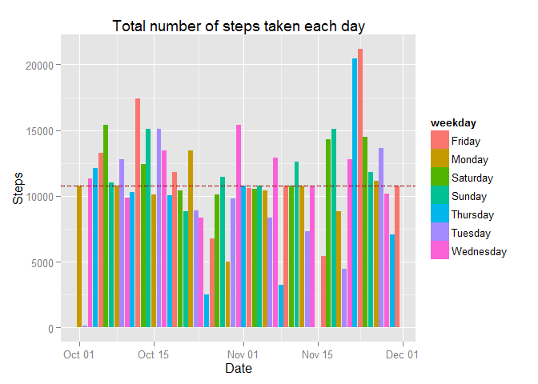
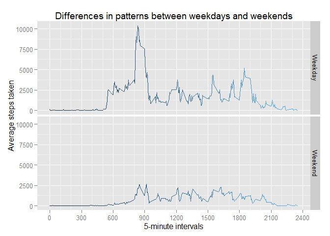

# Reproducible Research: Peer Assessment 1
Philip Mateescu  


### Preamble; Codebook

**Please Note:** GitHub does not render **R Markdown** the same way `knittr` does.
Nor does it render HTML files, but instead displays their content.  
Use this link to see 
the [*properly* rendered Rmd output](https://htmlpreview.github.io/? https://raw.githubusercontent.com/philipmat/RepData_PeerAssessment1/master/PA1_template.html).


This assignment makes use of data from a personal activity monitoring device. This device collects data at 5 minute intervals through out the day. The data consists of two months of data from an anonymous individual collected during the months of October and November, 2012 and include the number of steps taken in 5 minute intervals each day.

The data for this assignment can be downloaded from the course web
site:

* Dataset: [Activity monitoring data](https://d396qusza40orc.cloudfront.net/repdata%2Fdata%2Factivity.zip) [52K]

The variables included in this dataset are:

* **steps**: Number of steps taking in a 5-minute interval (missing
    values are coded as `NA`)
* **date**: The date on which the measurement was taken in YYYY-MM-DD
    format
* **interval**: Identifier for the 5-minute interval in which
    measurement was taken

We will be using the `dplyr` library for data processing, and `ggplot2` for drawing.


## Loading and preprocessing the data
Fortunately, this repository already contains the **activity.zip** file mentioned above.
However, let's guard against the file being missing for whatever reason:


```r
if(!file.exists("activity.zip")){
  download.file("https://d396qusza40orc.cloudfront.net/repdata%2Fdata%2Factivity.zip", destfile="activity.zip")
}
```

We don't need to extract the zip - the `unz` file can do this for us; on the fly:


```r
step.data <- read.csv(unz('activity.zip', filename = 'activity.csv'), colClasses = c('integer', 'Date', 'integer'))
```

For convenience, we'll also load it into a *dplyr* data frame tbl:

```r
step.data <- tbl_df(step.data)
ht(step.data)
```

```
## First 5:
## Source: local data frame [5 x 3]
## 
##   steps       date interval
##   (int)     (date)    (int)
## 1    NA 2012-10-01        0
## 2    NA 2012-10-01        5
## 3    NA 2012-10-01       10
## 4    NA 2012-10-01       15
## 5    NA 2012-10-01       20
## Last 5:
## Source: local data frame [5 x 3]
## 
##   steps       date interval
##   (int)     (date)    (int)
## 1    NA 2012-11-30     2335
## 2    NA 2012-11-30     2340
## 3    NA 2012-11-30     2345
## 4    NA 2012-11-30     2350
## 5    NA 2012-11-30     2355
```

## What is mean total number of steps taken per day?

For this part, we'll ignore the missing values.

```r
mean.steps.per.day <- mean(step.data$steps, na.rm = TRUE)
median.steps.per.day <- median(step.data$steps, na.rm = TRUE)

days.with.steps <- step.data  %>% 
    filter(!is.na(steps)) %>% 
    arrange(date) %>%
    mutate(month.name=months(date), weekday=weekdays(date))
ht(days.with.steps)    
```

```
## First 5:
## Source: local data frame [5 x 5]
## 
##   steps       date interval month.name weekday
##   (int)     (date)    (int)      (chr)   (chr)
## 1     0 2012-10-02        0    October Tuesday
## 2     0 2012-10-02        5    October Tuesday
## 3     0 2012-10-02       10    October Tuesday
## 4     0 2012-10-02       15    October Tuesday
## 5     0 2012-10-02       20    October Tuesday
## Last 5:
## Source: local data frame [5 x 5]
## 
##   steps       date interval month.name  weekday
##   (int)     (date)    (int)      (chr)    (chr)
## 1     0 2012-11-29     2335   November Thursday
## 2     0 2012-11-29     2340   November Thursday
## 3     0 2012-11-29     2345   November Thursday
## 4     0 2012-11-29     2350   November Thursday
## 5     0 2012-11-29     2355   November Thursday
```

```r
totalsteps.per.day <- days.with.steps  %>% 
    group_by(date) %>%
    summarize(steps.total=sum(steps))
# ht(totalsteps.per.day)
sum.steps.total <- sum(totalsteps.per.day$steps.total)
mean.steps.total <- mean(totalsteps.per.day$steps.total)
median.steps.total <- median(totalsteps.per.day$steps.total)
```

**Q1: Make a histogram of the total number of steps taken each day**


```r
ggplot(days.with.steps, aes(x = date, y = steps, fill = weekday)) + 
    geom_histogram(stat = 'identity') +
    ## add lines for the mean and the median - notice that being so close together they overlap
    geom_hline(aes(yintercept=mean.steps.total), color = 'red', linetype='dashed') +
    geom_hline(aes(yintercept=median.steps.total), color = 'black', linetype='dotted') +
    labs(title = 'Total number of steps taken each day', x = 'Date', y = 'Steps')
```

 

**Q2: Calculate and report the mean and median total number of steps taken per day**

Took a **total** of 570,608 steps,
with an **average** of 10,766 steps 
and a **median** value of 10,765 steps.

(*Note:* I've used the [inline R code](http://rmarkdown.rstudio.com/#inline-r-code) syntax to print the numbers 
calculated above.)


## What is the average daily activity pattern?

**Q1: Make a time series plot (i.e. type = "l") of the 5-minute interval (x-axis) and the average number of steps taken, averaged across all days (y-axis)**


```r
## average the time by interval
average.by.time <- days.with.steps %>%
    group_by(interval) %>%
    summarize(steps.average=mean(steps))

# ht(head(average.by.time, n = 5))
# ht(tail(average.by.time, n = 5))

# This is what we're asked to do, but the default plotting looks... plain.
# plot(average.by.time$interval, average.by.time$steps.average, type='l')
ggplot(average.by.time, aes(x=interval, y=steps.average, color = interval)) +
    geom_line() +  # line plot
    scale_x_continuous(minor_breaks=breaks.hourly, breaks=breaks.ampm) +  # break lines every hour
    theme(legend.position='none') +  # remove legend - I want the gradient but not the legend
    labs(title='Average number of steps each 5-minute interval across all days',
         x='5-minute intervals',
         y='Average steps taken')
```

 


**Q2: Which 5-minute interval, on average across all the days in the dataset, contains the maximum number of steps?**


```r
# sort the average.by.time in descending order by steps.average and take the first result
# it'll be the max
average.by.time.sorted <- average.by.time %>%
    arrange(desc(steps.average)) 
```

The **835 interval** has the **largest number of steps**:
206.1698113.

## Imputing missing values


**Q1: Calculate and report the total number of missing values in the dataset (i.e. the total number of rows with NAs)**


```r
nrow.step.data <- nrow(step.data)
nrow.days.with.steps <- nrow(days.with.steps)
```

Out of *total* 17,568 rows, 15,264 records *have values*, leaving us with
2,304 records **without values**.


**Q2: Devise a strategy for filling in all of the missing values in the dataset.**

Average by time seems a more reliable replacement. Since days might be missing altogether from the dataset, 
any date-relative strategies could yield missing values by themselves.

**Strategy**: we will replace all the missing values with the *average* for the interval across all days.

**Q3: Create a new dataset that is equal to the original dataset but with the missing data filled in.**


```r
# create a copy
step.data2 <- step.data
for(i in 1:nrow.step.data) {
    if (is.na(step.data2$steps[i])) {
        step.data2$steps[i] <- average.by.time[which(average.by.time$interval == step.data$interval[i]),]$steps.average
    }
}
# prove that the copy is different than the original
ht(step.data)
```

```
## First 5:
## Source: local data frame [5 x 3]
## 
##   steps       date interval
##   (int)     (date)    (int)
## 1    NA 2012-10-01        0
## 2    NA 2012-10-01        5
## 3    NA 2012-10-01       10
## 4    NA 2012-10-01       15
## 5    NA 2012-10-01       20
## Last 5:
## Source: local data frame [5 x 3]
## 
##   steps       date interval
##   (int)     (date)    (int)
## 1    NA 2012-11-30     2335
## 2    NA 2012-11-30     2340
## 3    NA 2012-11-30     2345
## 4    NA 2012-11-30     2350
## 5    NA 2012-11-30     2355
```

```r
ht(step.data2)
```

```
## First 5:
## Source: local data frame [5 x 3]
## 
##       steps       date interval
##       (dbl)     (date)    (int)
## 1 1.7169811 2012-10-01        0
## 2 0.3396226 2012-10-01        5
## 3 0.1320755 2012-10-01       10
## 4 0.1509434 2012-10-01       15
## 5 0.0754717 2012-10-01       20
## Last 5:
## Source: local data frame [5 x 3]
## 
##       steps       date interval
##       (dbl)     (date)    (int)
## 1 4.6981132 2012-11-30     2335
## 2 3.3018868 2012-11-30     2340
## 3 0.6415094 2012-11-30     2345
## 4 0.2264151 2012-11-30     2350
## 5 1.0754717 2012-11-30     2355
```

**Q4: Compare old and new data**

We will use the same calculation strategy, except for the new set.


```r
mean.steps2.per.day <- mean(step.data2$steps, na.rm = TRUE)
median.steps2.per.day <- median(step.data2$steps, na.rm = TRUE)

step.data2 <- step.data2  %>% 
    arrange(date) %>%
    mutate(month.name=months(date), weekday=weekdays(date))
ht(step.data2)    
```

```
## First 5:
## Source: local data frame [5 x 5]
## 
##       steps       date interval month.name weekday
##       (dbl)     (date)    (int)      (chr)   (chr)
## 1 1.7169811 2012-10-01        0    October  Monday
## 2 0.3396226 2012-10-01        5    October  Monday
## 3 0.1320755 2012-10-01       10    October  Monday
## 4 0.1509434 2012-10-01       15    October  Monday
## 5 0.0754717 2012-10-01       20    October  Monday
## Last 5:
## Source: local data frame [5 x 5]
## 
##       steps       date interval month.name weekday
##       (dbl)     (date)    (int)      (chr)   (chr)
## 1 4.6981132 2012-11-30     2335   November  Friday
## 2 3.3018868 2012-11-30     2340   November  Friday
## 3 0.6415094 2012-11-30     2345   November  Friday
## 4 0.2264151 2012-11-30     2350   November  Friday
## 5 1.0754717 2012-11-30     2355   November  Friday
```

```r
totalsteps2.per.day <- step.data2  %>% 
    group_by(date) %>%
    summarize(steps.total=sum(steps))
# ht (totalsteps.per.day)
sum.steps2.total <- sum(totalsteps2.per.day$steps.total)
mean.steps2.total <- mean(totalsteps2.per.day$steps.total)
median.steps2.total <- median(totalsteps2.per.day$steps.total)
```

**Q4.1: Make a histogram of the total number of steps taken each day**


```r
ggplot(step.data2, aes(x = date, y = steps, fill = weekday)) + 
    geom_histogram(stat = 'identity') +
    ## add lines for the mean and the median - notice that being so close together they overlap
    geom_hline(aes(yintercept=mean.steps2.total), color = 'red', linetype='dashed') +
    geom_hline(aes(yintercept=median.steps2.total), color = 'black', linetype='dotted') +
    labs(title = 'Total number of steps taken each day', x = 'Date', y = 'Steps')
```

 

**Q4.2: Calculate and report  the _mean_ and _median_ total number of steps taken per day**

After applyig the fill-in strategy, we have an **average** of 10,766 steps 
and a **median** value of 10,766 steps.

**Q4.3: Do these values differ from the estimates from the first part of the assignment? What is the impact of imputing missing data on the estimates of the total daily number of steps?**

|          |                         Mean |                           Median |
|---------:|-----------------------------:|---------------------------------:|
|Original  |      10,766|        10,765|
|*New*     |   *10,766*|     *10,766*|

Of course, since we're filling in with averages, we expected that 
the average of averages will be the same.

## Are there differences in activity patterns between weekdays and weekends?

We'll use the *facets* feature of `ggplot` to print two panels: 
one displaying the 5-minute interval data for the weekdays, 
the other for the weekends.

**Q1: Create a new factor variable in the dataset with two levels -- "weekday" and "weekend" indicating whether a given date is a weekday or weekend day.**

First, we'll have to group the dataset into weekdays and weekends measurements.
We'll do this using the built-in `weekdays` function in combination with *dplyr's*
`group_by` and `summarize` functions.


```r
week.steps <- step.data2 %>%
    mutate(day=weekdays(date, abbreviate=T), day.type=ifelse(day=='Sat' | day == 'Sun', 'Weekend', 'Weekday')) %>%
    group_by(interval, day.type) %>%
    summarize(steps.total=sum(steps))

ht(week.steps)
```

```
## First 5:
## Source: local data frame [5 x 3]
## Groups: interval [3]
## 
##   interval day.type steps.total
##      (int)    (chr)       (dbl)
## 1        0  Weekday 101.3018868
## 2        0  Weekend   3.4339623
## 3        5  Weekday  20.0377358
## 4        5  Weekend   0.6792453
## 5       10  Weekday   7.7924528
## Last 5:
## Source: local data frame [5 x 3]
## Groups: interval [3]
## 
##   interval day.type steps.total
##      (int)    (chr)       (dbl)
## 1     2345  Weekend  27.2830189
## 2     2350  Weekday  13.3584906
## 3     2350  Weekend   0.4528302
## 4     2355  Weekday  63.4528302
## 5     2355  Weekend   2.1509434
```

*Note:* we could be using a factor variable: `day <- factor(c('Weekday', 'Weekend'))`,
but I feel that the `mutate + if_else %>% group_by` combination makes it a bit easier to read
and it obviates the need for a factor.


**Q1: Make a panel plot containing a time series plot (i.e. type = "l") of the 5-minute interval (x-axis) and the average number of steps taken, averaged across all weekday days or weekend days (y-axis).**


```r
ggplot(week.steps, aes(x = interval, y = steps.total, color = interval)) +
    geom_line() +
    facet_grid(day.type ~ .) +  # break it into multiple panels aka facets
    scale_x_continuous(minor_breaks=breaks.hourly, breaks=breaks.ampm) +  # break lines every hour
    theme(legend.position='none') +  # remove legend - I want the gradient but not the legend
    labs(title='Differences in patterns between weekdays and weekends',
         x='5-minute intervals',
         y='Average steps taken')
```

 

From this plot we can see that the activity on weekdays is considerably higher than on weekends. 

